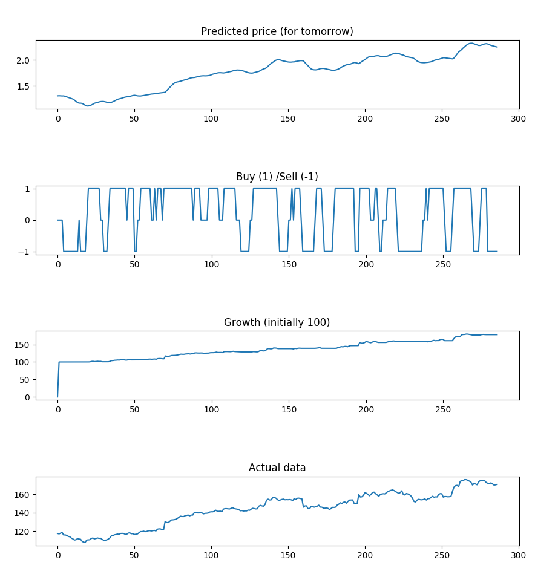
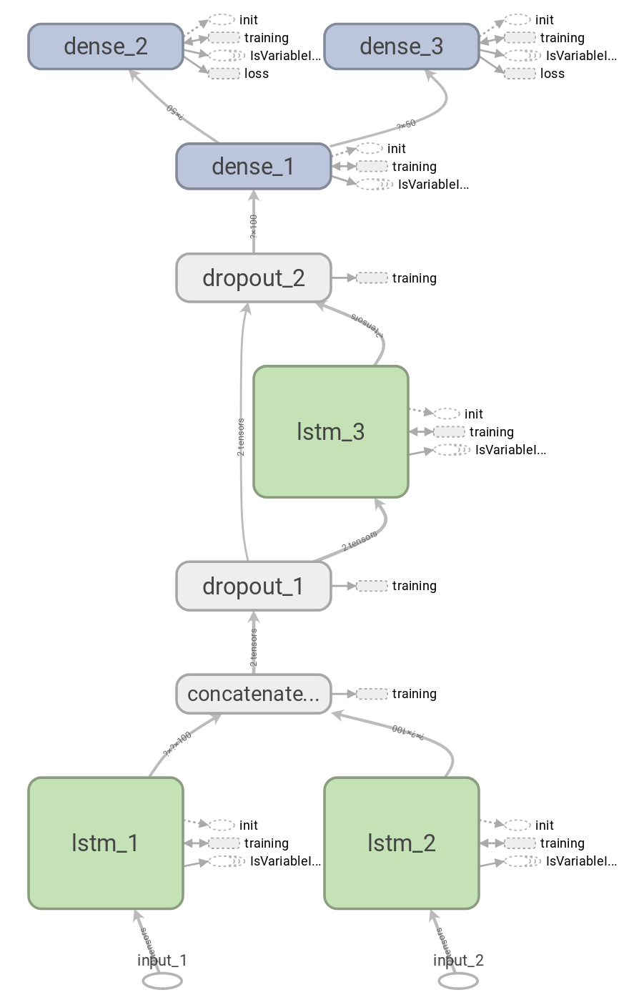

# AI Stock Analyser
In this project, I created a recurrent neural network for predicting stock prices based on two different inputs. The idea was to pick one stable price together with a more volatile stock to make a better prediction. The sample reference run is using the stock AAPL and the price of gold. The initial goal was to combine this Keras model with a tensorflow program that calculates general mood of people using sentiment analysis of tweets. As some problems were encountered (such as data availability) and twitter analysis was excluded from the scope.

The project was performed during a course in AI at KTH Royal Institute of Technology and the primary goal was to explore the use of TensorFlow and Keras to build a model that predicted something useful (despite the problem of completely unpredictable nature of stock markets). The results from the project were surprisingly good which is why I doubt them, as they should really be quite bad for this type of application.

The report contains more information about the project, it is however only available in Swedish.

## Result

This is the result from running the code with the stock price of AAPL and the price of gold.

## Model

The following tensorflow graph (DAG) represent the general flow of data in the program.

## Acknowledgements

The project took inspiration from multiple different sources, among others this website was important in the design decisions.

https://lilianweng.github.io/lil-log/2017/07/08/predict-stock-prices-using-RNN-part-1.html

